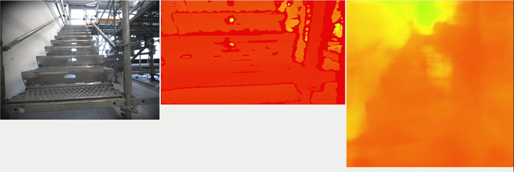
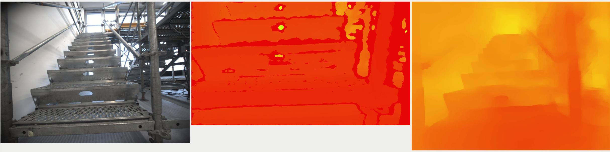
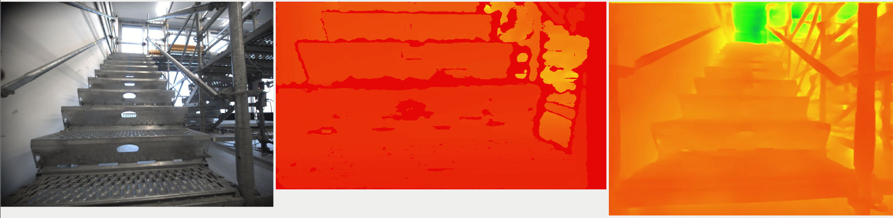

# Monocular Depth Estimation 

## Overview

### Model summary

Overall deployed models summary: 
| Model                      | Speed   | Quality on custom data | NYU Depth-v2 RMSE | Compatible Docker Base Image           |
|----------------------------|---------|------------------------|-------------------|----------------------------------------|
| FastDepth (2019 ICRA)      | ~60 FPS | Horrible               | 0.604             | docker/Dockerfile.fix_cv_bridge        |
| GuidedDecoding (2022 ICRA) | ~6 FPS  | Not bad                | 0.478             | docker/Dockerfile.fix_cv_bridge        |
| GLPN (SOTA in 2022)        | ~1/3 FPS| Good                   | 0.344             | docker/Dockerfile.huggingface          |

Qualitative result on our custom data: 
<!-- a table for images -->
| Model | Wide-angle camera; realsense D435; mono-depth prediction |
|-------|----------------------------------------------------------|
|FastDepth|  |
|GuidedDecoding|  |
|GLPN|  |


### Run the package
For all the models in the package, you can deploy & run them by following commands **inside the docker container**:

Tips: Make sure you are in the correct container before running commands.

Package deployment: 
```bash
# in the docker container
mkdir -p /workspace/catkin_ws/src 
ln -s /repo/jetson_perception_ros_nodes /workspace/catkin_ws/src/
# build the package
cd /workspace/catkin_ws
catkin_init_workspace 
catkin_make
```

Before running the nodes, you should check the [config file](../../config/default.yaml) and make sure models and paths are correct. Then you can run the nodes by running the launch file:
```bash
# run the package
source /workspace/catkin_ws/devel/setup.bash
roslaunch jetson_perception_ros_nodes run.launch
```


## Fast Depth 
All the dependencies are included in the base jetson docker image provided by nvdia. 

Please refer to this page for detailed instructions: [depthnet](https://github.com/dusty-nv/jetson-inference/blob/master/docs/depthnet.md)


## GuidedDecoding 


### Extra dependencies: 
```bash
pip3 install matplotlib
```

### Preparing pre-trained models 
You should place the pre-trained feature extractor [DDRNet-23 slim](https://drive.google.com/file/d/1mg5tMX7TJ9ZVcAiGSB4PEihPtrJyalB4/view). Then place it under folder[./GuidedDecoding/model/weights](./GuidedDecoding/model/weights) or change the hard-coded path in [./GuidedDecoding/model/DDRNet_23_slim.py](./GuidedDecoding/model/DDRNet_23_slim.py) on line 361.

Then download the pre-trained model weights [here](https://drive.google.com/file/d/1TNTUUve5LHEv6ERN6v9aX2eYw1-a-4bO/view?usp=sharing). You should specify the path in [config file](../../config/default.yaml).

Please refer to [official repo](https://github.com/mic-rud/guideddecoding) for detailed instructions and trouble shooting.

## GLPN

First, to run GLPN you need to build the docker locally by running the following command in the root of the repo:
```bash
# for example 
docker build -t docker/Dockerfile.huggingface -t sgtvincent/ros:noetic-pytorch-huggingface-l4t-r35.3.1 .
```

Then, you can run the docker by running the script:
```bash
# remember to change the image tag in the script
bash ./docker/docker_run_ros_pytorch_huggingface.sh
```

Then you can deploy & run the package in the normal way.